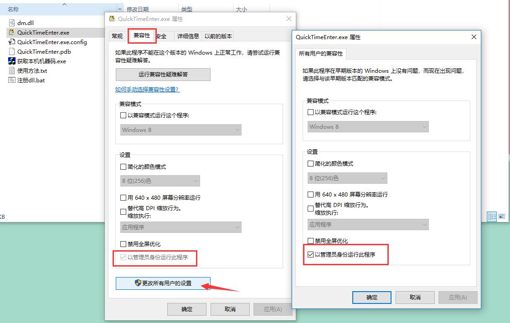

# LOLFlashRecorder
LOL Flash Recorder (LFR) 用于LOL快速记录闪现时间

## **第一次使用请注意**

如果你是第一次使用这个软件，请仔细阅读下面的信息：

- **请先运行软件目录下方的`注册dll.bat`文件**，只用运行一次即可，以后都不用再次运行。
- 当你软件路径更换时或者是重命名文件夹时，需要重新运行。

## 如果无法使用请注意权限设置

请用管理员权限执行程序，以保证全局快捷键正确运行



## 软件使用方法
1. 在游戏开始使按下开始按键，开始计时，当然你也可以调整时间并开始
2. 当对方闪现后，按下F1~F5，依次对应敌方上、野、中、下、辅
3. 按下Shift+F1~F5可以取消计时
4. 按后按下F6，将对方闪现情况发送到聊天窗口
5. 对局结束后按下重置按钮，重置时间

## 快捷键对照
```
F1		上单闪现计时
F2		打野闪现计时
F3		中单闪现计时
F4		下路闪现计时
F5		辅助闪现计时
F6		发送闪现信息
F7		开始或停止游戏时间
F8		重置游戏时间
```